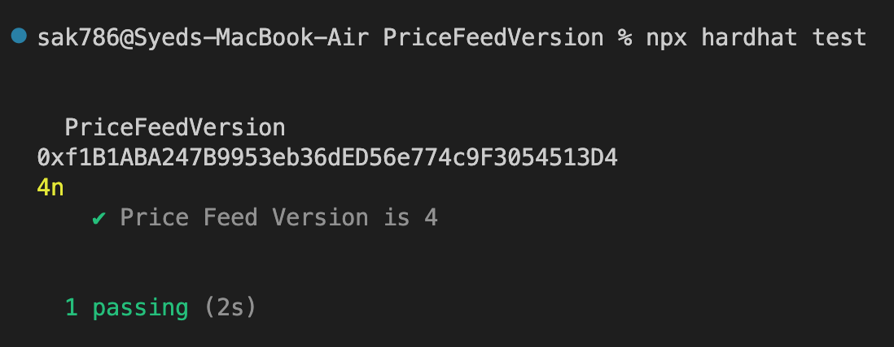

# Price Feed Version Test

This project demonstrates a basic Hardhat test for checking the price feed version on Sepolia testnet using forking.

Execute this command to run the test:

```shell
npx hardhat test
```

Terminal Output:


